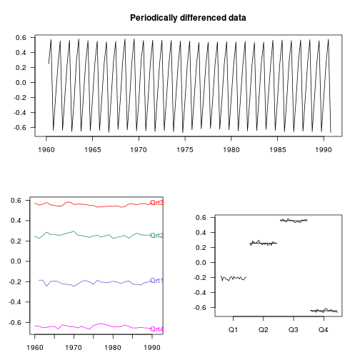

R package partsm 
========================================================

This is the official page for the source code of R package *partsm*, featuring Periodic Autoregressive Time Series Models, available in [CRAN](http://cran.r-project.org/web/packages/partsm/index.html).

For a detailed introduction to periodic autoregressive models, and to the package, look at the [vignette]
(http://cran.r-project.org/web/packages/partsm/vignettes/partsm.pdf).

A quick gallery of partsm
-------------------------


### Fit a PAR(2) model with seasonal intercepts.


```
## ----
##   PAR model of order 2 .
## 
##   y_t = alpha_{1,s}*y_{t-1} + alpha_{2,s}*y_{t-2} + ... + alpha_{p,s}*y_{t-p} + coeffs*detcomp + epsilon_t,  for s=1,2,...,4
## ----
##   Autoregressive coefficients. 
## 
##            s=1  s=2   s=3  s=4
## alpha_1s  1.36 0.28  1.24 0.64
## alpha_2s -0.38 0.68 -0.32 0.42
```


### Test for periodic variation in the autoregressive parameters


```
## ----
##   Test for periodicity in the autoregressive parameters .
## 
##   Null hypothesis: AR( 2 ) with the selected deterministic components.
##   Alternative hypothesis: PAR( 2 ) with the selected deterministic components.
## 
##   F-statistic: 43.46 on 6 and 116 DF, p-value: 0 *** 
## 
##   Signif. codes:  0 '***' 0.001 '**' 0.01 '*' 0.05 '.' 0.1 ' ' 1
```


### Test for seasonal heteroskedasticity 


```
## ----
##   Test for seasonal heteroskedasticity .
## 
##   F-statistic: 2.77 on 3 and 121 DF, p-value: 0.04469 * 
## 
##   Signif. codes:  0 '***' 0.001 '**' 0.01 '*' 0.05 '.' 0.1 ' ' 1
```


### Graphical Representation of the Periodically Differenced Data



